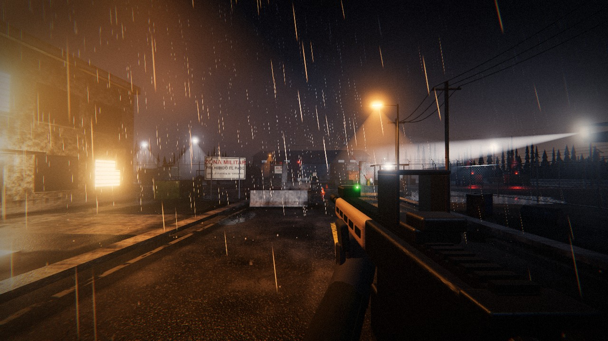
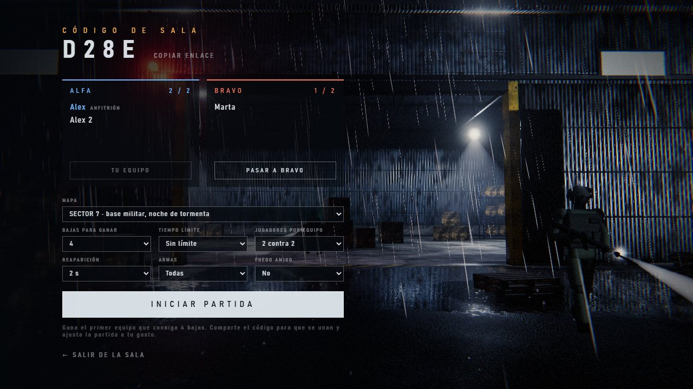
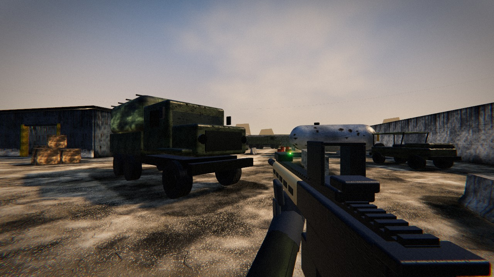
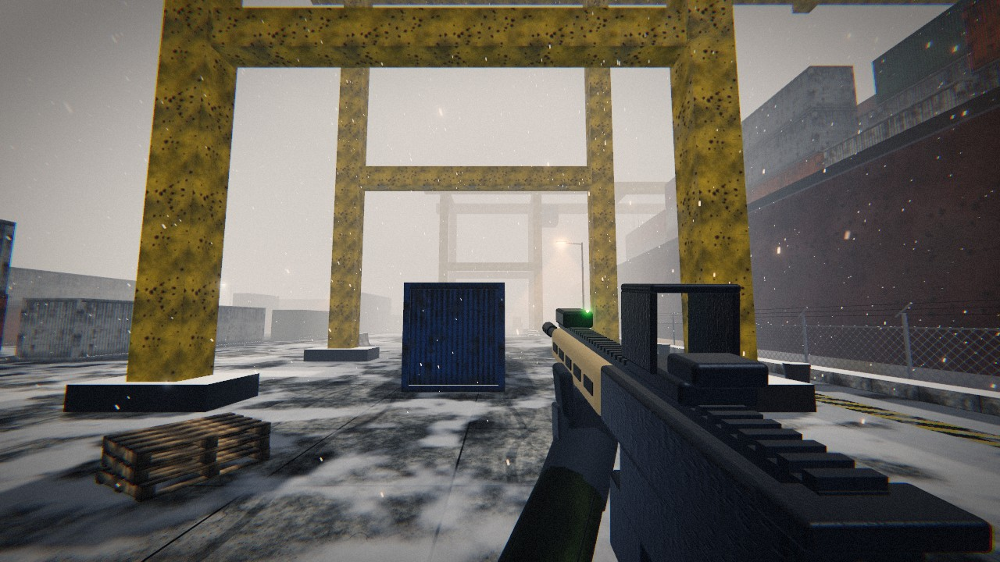
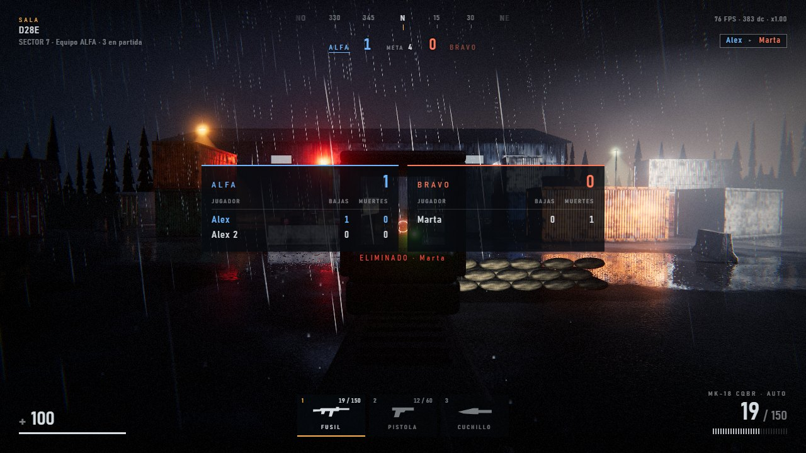

# NIGHTFALL

**Shooter en primera persona para el navegador**, con una misión en solitario y partidas en línea por equipos. No hay nada que instalar para jugar: se abre una dirección web y listo.



Todo lo que se ve y se oye está generado por código: no hay ni un solo archivo de imagen, modelo 3D o sonido. Las texturas, los soldados, las armas, la lluvia, la nieve y los disparos se construyen al arrancar.

---

## Cómo se juega

### Misión en solitario

Infíltrate de noche en una base abandonada, cruza el control de acceso y llega al terminal del almacén. Diez soldados patrullan, se cubren, se avisan entre ellos y te buscan si te oyen. El cuchillo no hace ruido: una puñalada por la espalda elimina a un guardia sin alertar al resto.

### Partidas en línea por equipos

Dos equipos, **ALFA** y **BRAVO**, se enfrentan hasta que uno alcanza el número de bajas acordado.

1. Pulsa **Multijugador**, escribe tu nombre y **crea una partida**.
2. Comparte el **código de 4 letras** o el enlace de invitación.
3. Los demás se unen, eligen equipo y el anfitrión inicia la partida.



Quien llega tarde puede entrar con la partida empezada. Al terminar se vuelve a la sala y el anfitrión puede lanzar la revancha.

---

## Mapas

Los tres tienen el mismo tamaño (unos 96 × 80 m) y cada uno se juega distinto.

| | Mapa | Ambiente | Cómo se juega |
|---|---|---|---|
|  | **Sector 7** | Base militar, noche de tormenta | El mapa de la misión. Patio de contenedores y almacén; la luz la ponen las farolas y tu linterna. |
|  | **La Solana** | Depósito en el desierto, atardecer | Simétrico, con tres carriles: contenedores al norte, una nave que se cruza por dentro y una explanada abierta al sur para tiros largos. |
|  | **Muelle Norte** | Puerto bajo la nevada, niebla cerrada | No se ve a más de 40 m. Calles entre hileras de contenedores y un muelle con grúas pórtico y un carguero atracado. |

---

## Armas

Se cambia con **1**, **2** y **3**, con la rueda del ratón o con **Q** (vuelve a la anterior).

| Arma | Funcionamiento | Daño entre jugadores |
|---|---|---|
| **Fusil** MK-18 | Automático, 30 balas | 26 al torso |
| **Pistola** P22 | Un disparo por clic, 12 balas | 17 al torso |
| **Cuchillo** | Tajo a 2 m; corres un 12 % más rápido | 55 de frente · **mortal por la espalda** |

Con las armas de fuego, un disparo a la cabeza hace más del doble de daño y uno a las piernas algo menos. Cada jugador tiene 100 de vida, que se recupera sola al cabo de unos segundos sin recibir daño.



---

## Ajustes de la partida

Los decide el anfitrión en la sala, antes de empezar.

| Ajuste | Opciones |
|---|---|
| Mapa | Sector 7, La Solana o Muelle Norte |
| Bajas para ganar | De 5 a 100 |
| Tiempo límite | Sin límite, o de 5 a 30 minutos (al agotarse gana quien vaya por delante; igualados, empate) |
| Jugadores por equipo | De 1 contra 1 a 6 contra 6 |
| Reaparición | De 1 a 12 segundos |
| Armas | Todas, pistola y cuchillo, o solo cuchillo |
| Fuego amigo | Sí o no |

Durante la partida el nombre de tus compañeros se ve siempre sobre su cabeza; el de un rival solo aparece mientras le apuntas. Al reaparecer tienes unos segundos de protección, que se pierden si disparas.

---

## Controles

| Tecla | Acción |
|---|---|
| **W A S D** | Moverse |
| **Ratón** | Mirar |
| **Clic izquierdo** | Disparar o dar un tajo |
| **Clic derecho** | Apuntar |
| **R** | Recargar |
| **1 · 2 · 3** | Fusil, pistola, cuchillo |
| **Rueda / Q** | Cambiar de arma |
| **Shift** | Esprintar |
| **Ctrl / C** | Agacharse |
| **Espacio** | Saltar |
| **F** | Linterna |
| **Tab** | Tabla de jugadores (en línea) |
| **Esc** | Pausa o menú |

Se recomienda jugar con auriculares y a pantalla completa (F11).

---

## Ejecutarlo en tu ordenador

Hace falta [Node.js](https://nodejs.org) 20 o superior.

```bash
npm install
npm start
```

Abre **http://localhost:5173**. En Windows también vale con hacer doble clic en `start.bat`.

Para jugar con gente de tu misma red wifi:

```bash
npm run lan
```

El servidor mostrará la dirección que deben abrir los demás.

---

## Publicarlo en internet

El juego necesita un alojamiento que **ejecute Node y admita WebSockets**; un alojamiento solo de archivos no sirve, porque las salas las lleva el servidor.

El repositorio incluye `render.yaml`, listo para [Render](https://render.com): se crea un *Blueprint* a partir de este repositorio y Render instala, arranca y da una dirección `https`. En un alojamiento el servidor acepta conexiones de fuera automáticamente.

A tener en cuenta:

- Las salas viven en la memoria del servidor: debe haber **una sola instancia**, y si se reinicia se cortan las partidas en curso.
- Los planes gratuitos suelen dormir el servidor cuando nadie lo usa; el primero que entra espera a que despierte.

---

## Cómo está hecho

- **[Three.js](https://threejs.org)** sobre WebGL, sin paso de compilación: el navegador carga los módulos tal cual.
- **Servidor mínimo** en Node: `server.js` sirve los archivos y `rooms.js` lleva las salas por WebSocket. Su única dependencia es `ws`.
- **Red sencilla a propósito**: quien dispara decide si acierta, según lo que ve en su pantalla; la víctima aplica el daño y avisa de su muerte; el servidor solo reparte posiciones, lleva el marcador y decide cuándo acaba la partida.

```
server.js          servidor web
rooms.js           salas, equipos, marcador y ajustes
index.html, css/   página, menús y HUD
src/
  main.js          arranque, estados del juego y bucle principal
  maps.js          catálogo de mapas
  world/           un archivo por mapa, más las piezas comunes (vehículos, contenedores…)
  weapon.js        las tres armas
  combat.js        daño, bajas y bidones explosivos
  net.js           conexión con el servidor
  remotePlayers.js los demás jugadores en pantalla
  enemies.js       inteligencia de los soldados de la misión
tools/             pruebas automáticas
```

Para añadir un mapa: un archivo nuevo en `src/world/`, una línea en `src/maps.js` y subir `MAP_COUNT` en `rooms.js`.

### Pruebas

```bash
npm run test:online
```

Abre dos navegadores y un tercer jugador simulado, y juega partidas completas en los tres mapas: crear sala, unirse, disparar, morir, reaparecer, cambiar ajustes y terminar. Necesita Google Chrome instalado en Windows en su ruta habitual.

---

## Estado del proyecto

Funciona y está comprobado con pruebas automáticas, pero conviene saber dónde están los límites:

- **Todavía no se ha jugado con muchas personas reales ni por internet.** Las pruebas se han hecho en un solo ordenador.
- **No hay protección contra trampas.** Está pensado para jugar entre conocidos.
- La primera vez que se carga un mapa hay una pausa de unos segundos.
- Los valores de daño, tiempos y el diseño de los mapas nuevos son un punto de partida, pendiente de ajustar jugando.
- Pide una tarjeta gráfica decente; la calidad se ajusta sola si el equipo no llega.
